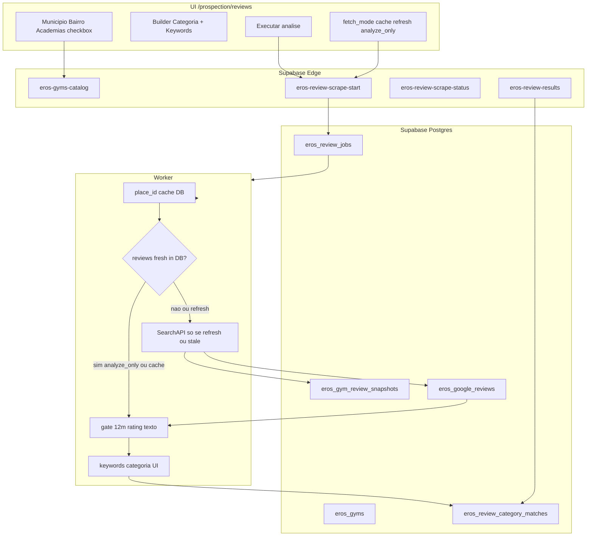

# Plano: Reviews + Clusterização para Prospecção Outbound

## Contexto atual

- Scrape piloto manual em [`scripts/scrape-google-reviews-negative-gate.ts`](scripts/scrape-google-reviews-negative-gate.ts) — 1 `place_id` fixo, MCP SearchAPI, paginação `lowest_rating` + `newest`.
- Outputs experimentais em [`data/processed/wellhub-pass2-google-reviews-*.json`](data/processed/) — piso, equipamento, negativos gate.
- Catálogo SP em [`data/academia.train.json`](data/academia.train.json) / [`public/data/academia.train.json`](public/data/academia.train.json) — ~WH+TP+GP, campo `cidade`, **sem `bairro` tipado** na maioria (só GuruPass nativo).
- **`google_place_id` não está no pipeline principal** — GuruPass detail tem (`googlePlaceId`); Wellhub/TotalPass precisam resolver via `google_maps_search`.
- UI prospecção placeholder: [`src/components/eros/ErosProspection.tsx`](src/components/eros/ErosProspection.tsx).

## Arquitetura alvo



## Princípio: scrape uma vez, analisar N vezes (dados no DB)

**Problema:** rodar SearchAPI a cada mudança de categoria/keyword quebra custo e tempo.

**Solução:** separar duas fases persistidas no Postgres:

| Fase | O que faz | Quando chama SearchAPI |
|------|-----------|------------------------|
| **Fetch (scrape)** | Baixa reviews Google → grava `eros_google_reviews` + metadata em `eros_gym_review_snapshots` | Só se cache ausente, expirado, ou usuário pede **Atualizar** |
| **Analyze (cluster)** | Lê reviews do DB → aplica gates + keywords da UI → grava `eros_review_category_matches` | **Nunca** chama API externa |

Usuário troca categorias/keywords/rating bands → novo job **`analyze_only`** → re-cluster em segundos, zero API.

## 1. Modelo de dados (migration Supabase)

Nova migration em `supabase/migrations/`:

| Tabela | Papel |
|--------|--------|
| `eros_gyms` | Catálogo SP + `google_place_id` cacheado |
| `eros_gym_review_snapshots` | **1 row por academia** — controle de cache: `gym_id`, `place_id`, `fetched_at`, `reviews_count`, `pagination_meta` JSON, `ttl_expires_at`, `source` (searchapi) |
| `eros_google_reviews` | **Cache durável** de reviews: `review_id` UNIQUE global, `gym_id`, `place_id`, `user_name`, `rating`, `iso_date`, `text`, `link`, `first_seen_at`, `last_seen_at` |
| `eros_review_jobs` | Job: `fetch_mode`, `status`, `reference_date`, `date_gate`, `gym_ids[]`, `categories` JSONB, `rating_bands[]`, `progress`, `cache_stats` JSON |
| `eros_review_category_matches` | Resultado da análise (regerável): `job_id`, `gym_id`, `review_id`, `category_name`, `rating_band`, `matched_keywords[]`, `quote` |
| `eros_review_category_presets` | Presets do usuário (opcional v1) |

### Cache TTL e invalidação

- **Default TTL:** 7 dias (`ttl_expires_at = fetched_at + 7d`) — configurável via env `REVIEW_CACHE_TTL_DAYS`
- **`fetch_mode` no job:**
  - `cache` (default UI) — usa DB se snapshot fresh; scrape só academias stale/ausentes
  - `refresh` — força re-scrape de todas selecionadas; upsert reviews (merge por `review_id`)
  - `analyze_only` — **zero SearchAPI**; exige reviews já em `eros_google_reviews`; só roda clusterizer
- Upsert reviews: `ON CONFLICT(review_id) DO UPDATE` — atualiza `last_seen_at`, preserva histórico
- `google_place_id` em `eros_gyms` — cache permanente até rematch manual

### Índices

`(gym_id, iso_date)`, `(gym_id, fetched_at)` via snapshot, `(job_id, category_name, rating_band)`, `(cidade, uf, bairro_normalizado)`.

### Modelo `categories` (input do usuário — única fonte da clusterização)

Cada job carrega o que o usuário definiu na UI. Nada de lista fixa no código.

```json
{
  "categories": [
    {
      "name": "Piso",
      "keywords": ["piso", "borracha", "troca", "antiderrapante", "encardido", "amassado"]
    },
    {
      "name": "Equipamentos",
      "keywords": ["aparelho", "equipamento", "esteira", "halter", "manutenção"]
    }
  ]
}
```

Regras:

- **`name`** (categoria): label livre escolhido pelo usuário — ex. "Piso", "Esteiras", "Preço"
- **`keywords`**: array livre, 1+ termos por categoria; normalização accent-fold no match
- **`negative_keywords`**: opcional por categoria (UI avançada) — excluir falso positivo
- Clusterizer **só usa `categories` do job** — zero fallback hardcoded
- Presets: atalho UI — não substituem DB de reviews

## 2. Catálogo SP (município → bairro → academia)

**Script one-shot:** `scripts/build-gym-catalog-sp.ts`

- Fonte: [`data/raw/wellhub-brasil-all.json`](data/raw/wellhub-brasil-all.json), totalpass, gurupass — filtrar `uf === 'SP'`.
- Reutilizar [`scripts/lib/academia-normalize.ts`](scripts/lib/academia-normalize.ts) para nome/cidade/endereco/lat/lng.
- **Extrair bairro** do endereço (regex padrão BR: `"Bairro - Cidade"`) + GuruPass `neighborhood` quando existir.
- Dedup heurístico opcional: mesmo `nome` + lat dentro de 200m → 1 registro com múltiplos `source_aggregator`.
- Upsert em `eros_gyms`.

**Edge `eros-gyms-catalog`** (GET):

- `?uf=SP` → lista municípios distintos
- `?uf=SP&municipio=São Paulo` → bairros distintos
- `?uf=SP&municipio=...&bairro=...` → academias com **`cache_status`**: `{ has_reviews, fetched_at, reviews_count, is_stale }` lido de `eros_gym_review_snapshots`

## 3. Lib compartilhada de scrape + cluster (extraída do piloto)

Refatorar [`scripts/scrape-google-reviews-negative-gate.ts`](scripts/scrape-google-reviews-negative-gate.ts) em módulos reutilizáveis:

| Módulo | Responsabilidade |
|--------|------------------|
| [`scripts/lib/searchapiMcpClient.ts`](scripts/lib/searchapiMcpClient.ts) | MCP HTTP (`google_maps_reviews`, `google_maps_search`, `google_maps_place`) — token de env `SEARCHAPI_MCP_TOKEN` |
| [`scripts/lib/placeIdResolver.ts`](scripts/lib/placeIdResolver.ts) | Resolver/cache `place_id` por `{nome, endereco, lat, lng}`; score por distância + nome |
| [`scripts/lib/googleReviewsPaginator.ts`](scripts/lib/googleReviewsPaginator.ts) | Paginação: `lowest_rating` exhaust + `newest` até gate |
| [`scripts/lib/reviewFilters.ts`](scripts/lib/reviewFilters.ts) | Gates reutilizáveis |
| [`scripts/lib/reviewCache.ts`](scripts/lib/reviewCache.ts) | Ler/escrever cache DB: snapshot fresh?, load reviews by gym_id, upsert batch |
| [`scripts/lib/reviewClusterizer.ts`](scripts/lib/reviewClusterizer.ts) | Match keywords — **sempre sobre rows do DB** |

### Fluxo cache-first por academia

```
1. place_id em eros_gyms? senão resolve (1x) → grava DB
2. fetch_mode == analyze_only?
   → SELECT eros_google_reviews WHERE gym_id = ?
   → se vazio: erro "sem cache — rode Atualizar primeiro"
3. fetch_mode == cache && snapshot fresh (ttl_expires_at > now)?
   → pula SearchAPI
4. senão (stale ou refresh)
   → paginate MCP → upsert eros_google_reviews + eros_gym_review_snapshots
5. clusterizer lê reviews do DB → insert eros_review_category_matches
```

**Histórico no DB:** reviews raw ficam em `eros_google_reviews`; cada job gera novo snapshot de matches em `eros_review_category_matches` — comparar jobs outbound sem re-fetch.

```ts
reference_date = new Date() // hoje
date_gate = reference_date - 12 months

requireText(review) => review.text?.trim().length > 0

critical => rating <= 3 && requireText && iso_date >= date_gate
positive => rating >= 4 && requireText && iso_date >= date_gate
```

Reviews sem texto **nunca entram** — independente da estrela.

### Clusterização (100% driven by UI input)

- Input: review com texto + rating band + **`categories[]` do job** (copiado do POST/UI)
- Para cada categoria definida pelo usuário: match se qualquer `keyword` (case/accent fold) aparece no texto
- `negative_keywords` opcional por categoria (se usuário preencher)
- 1 review pode cair em **múltiplas categorias**
- Output agregado por academia: `{ category_name, critical_count, positive_count, samples[] }`
- **Proibido:** seed SQL, enum fixo, ou lista default no frontend — UI inicia com 1 linha vazia "Nova categoria"

## 4. Edge Functions (job async)

### `eros-review-scrape-start` (POST)

Body:

```json
{
  "gym_ids": ["uuid", "..."],
  "fetch_mode": "cache",
  "categories": [
    { "name": "Piso", "keywords": ["piso", "borracha", "troca", "antiderrapante"] }
  ],
  "rating_bands": ["critical", "positive"]
}
```

- `fetch_mode`: `cache` (default) | `refresh` | `analyze_only`
- Valida categorias; persiste tudo em `eros_review_jobs` incluindo `fetch_mode`
- Retorna `{ job_id }`

### Processamento do job

Self-chaining worker (max 3 gyms/invocation).

Fluxo por academia:

1. `place_id` — ler `eros_gyms`; resolver só se null → gravar DB
2. **Fetch** — conforme `fetch_mode` + `eros_gym_review_snapshots` (ver fluxo cache-first)
3. **Analyze** — `SELECT` reviews do DB → filtros + cluster → `eros_review_category_matches`
4. Progress + `cache_stats`: `{ api_calls: N, cache_hits: M, reviews_from_db: K }`

### `eros-review-scrape-status` (GET `?job_id=`)

- `status`, progress, `cache_stats`, `errors[]`

### `eros-review-results` (GET `?job_id=`)

- Agregação por `gym_id` + `category_name` + `rating_band`
- Lista reviews matched com quote, rating, iso_date, link
- Summary outbound-friendly: "Perfect Body — piso: 0 critical / 1 adjacent nos 12m; equipamento: 0 critical, 4 positive"

### `eros-review-category-presets` (opcional v1)

- GET — listar presets do `company_id`
- POST — salvar `{ name, keywords[], negative_keywords[]? }`
- DELETE — remover preset
- Presets **não alimentam** clusterizer direto — só pré-preenchem UI; job sempre usa snapshot editado pelo usuário

## 5. Rota UI

**Nova rota:** `/prospection/reviews` em [`src/App.tsx`](src/App.tsx) + item Sidebar (sub ou substituir label Prospecção).

**Componente:** `src/components/eros/ReviewsProspectionLab.tsx`

Layout em 3 colunas (padrão visual de [`AggregatorTrainLab.tsx`](src/components/ml/AggregatorTrainLab.tsx)):

1. **Filtros geográficos (cascata)**
   - UF fixo SP (badge pilot)
   - Select município → carrega bairros
   - Select bairro → lista academias com checkbox + **badge cache** por row: "Reviews em {data}" / "Sem cache" / "Desatualizado"
   - "Selecionar todas"

2. **Builder de categorias**
   - "+ Categoria" — nome + keywords (chips) + negative opcional; presets salvos no DB
   - Toggle rating bands ≤3 / ≥4; gate 12m read-only

3. **Modo de execução (dados no DB)**
   - **Usar cache** (`fetch_mode=cache`) — default; scrape só academias sem cache ou TTL expirado
   - **Atualizar reviews** (`fetch_mode=refresh`) — força SearchAPI nas selecionadas; upsert DB
   - **Re-analisar** (`fetch_mode=analyze_only`) — só cluster no DB; troca categorias/keywords sem API
   - Status job mostra: `cache_hits`, `api_calls`, `reviews_from_db`

4. **Execução + resultados**
   - Botões: "Analisar (cache)" | "Atualizar e analisar" | "Re-analisar categorias"
   - Progress + `cache_stats` em tempo real
   - Tabela academia × categoria × critical/positive
   - Expand → citations; export JSON/CSV
   - Link "Ver jobs anteriores" — lista `eros_review_jobs` do mesmo filtro geo (histórico DB)

**Service:** `src/services/reviewsProspectionService.ts` — wrappers Supabase invoke.

## 6. Estratégia outbound (output do sistema)

Por academia selecionada, o job produz matriz utilizável para produtos Vectra:

| Sinal | Uso outbound |
|-------|----------------|
| `critical` + categoria definida pelo usuário (ex. Piso) in-gate | Dor ativa no produto que o usuário está prospectando |
| `critical` ausente + `positive` presente na mesma categoria | Hipótese "problema resolvido" — contraste temporal |
| `positive` in-gate | Prova social / timing pós-investimento |
| Múltiplas categorias no mesmo job | Matriz outbound multi-produto (piso + equipamento + preço, etc.) |

UI deve destacar **contraste temporal** (critical antigo fora gate vs silence in-gate) como metadado, não opinião hardcoded.

## 7. Ordem de implementação

1. Migration + tabelas cache DB
2. `build-gym-catalog-sp.ts`
3. Libs MCP + **reviewCache** + clusterizer
4. Edge + worker cache-first
5. UI + modos cache/refresh/analyze_only
6. Smoke two-pass: refresh → analyze_only

## 8. Riscos e mitigação

| Risco | Mitigação |
|-------|-----------|
| SearchAPI rate/custo | **DB-first** — `analyze_only` zero API; TTL 7d; badge stale na UI |
| `place_id` errado WH/TP | Score + `place_match_confidence`; UI flag "revisar match" se confidence < 0.8 |
| Bairro ausente/errado | Fallback "Sem bairro" bucket; melhorar regex incrementalmente |
| Edge timeout job grande | Self-chaining worker; max gyms por run configurável |
| Token MCP só local | Secret `SEARCHAPI_MCP_TOKEN` no Edge via `push-edge-secrets.ps1` |

## 9. Fora do escopo v1 (backlog)

- Dedup cross-aggregator (mesma academia WH+GP)
- Ingest reviews no RAG (`eros_knowledge_chunks`)
- Integração direta com `eros_prospects` / SPIN composer
- Brasil inteiro (expandir após validar SP)

## Arquivos principais a criar/alterar

- **Novo:** `supabase/migrations/YYYYMMDD_eros_reviews_prospection.sql`
- **Novo:** `scripts/build-gym-catalog-sp.ts`, `scripts/lib/searchapiMcpClient.ts`, `placeIdResolver.ts`, `googleReviewsPaginator.ts`, `reviewFilters.ts`, `reviewCache.ts`, `reviewClusterizer.ts`
- **Refator:** [`scripts/scrape-google-reviews-negative-gate.ts`](scripts/scrape-google-reviews-negative-gate.ts) → thin CLI usando libs
- **Novo:** `supabase/functions/eros-gyms-catalog/`, `eros-review-scrape-start/`, `eros-review-scrape-worker/`, `eros-review-scrape-status/`, `eros-review-results/`, `eros-review-category-presets/` (opcional)
- **Novo:** `src/components/eros/ReviewsProspectionLab.tsx`, `src/components/eros/ReviewCategoryBuilder.tsx`, `src/services/reviewsProspectionService.ts`
- **Alterar:** [`src/App.tsx`](src/App.tsx), [`src/components/Sidebar.tsx`](src/components/Sidebar.tsx)
